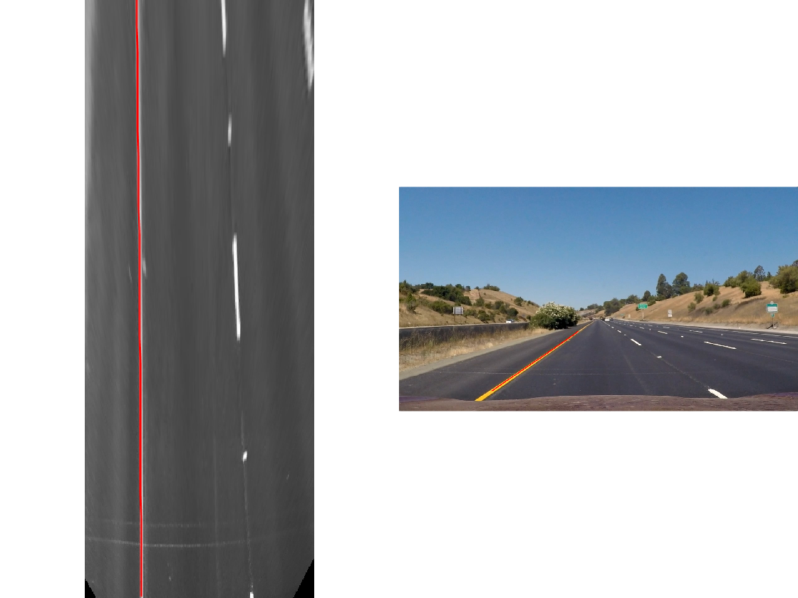
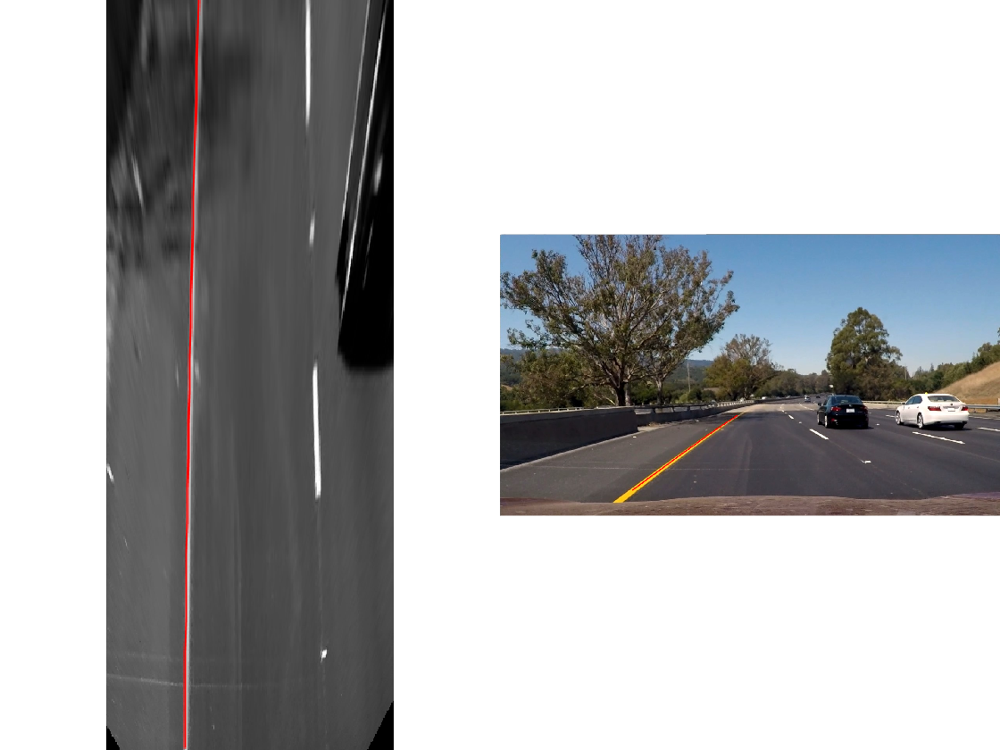

```matlab:Code
clc
close all
clear all
```

## 1. Calibration using test images

```matlab:Code
calibrationImagesFileNames = {
    fullfile(pwd, 'calibration2.jpg')
    fullfile(pwd, 'calibration3.jpg')
    fullfile(pwd, 'calibration4.jpg')
    fullfile(pwd, 'calibration5.jpg')
};

testImagesFileNames = {
    fullfile(pwd, 'straight_lines1.jpg')
    fullfile(pwd, 'straight_lines2.jpg')
    fullfile(pwd, 'test3.jpg')
    fullfile(pwd, 'test6.jpg')
};
```


```matlab:Code
% Load calibration images
images         = imageSet(calibrationImagesFileNames);
imageFileNames = images.ImageLocation;

% Detect checkerboard points in calibration images
[imagePoints, boardSize] = detectCheckerboardPoints(imageFileNames);

% Plot the results for the first image
%     figure;
%     I = imread(imageFileNames{1});
%     imshow(I);
%     hold on;
%     plot(imagePoints(:,1,1),imagePoints(:,2,1),'ro');
%     hold off;

% Prepare data set for camera calibration
squareSizeInMM = 29;
worldPoints    = generateCheckerboardPoints(boardSize, squareSizeInMM);

% Camera calibration:
% params variable contains the internal and external camera parameters.
I = readimage(images,1); 
imageSize = [size(I, 1), size(I, 2)];
params = estimateCameraParameters( ...
    imagePoints,                   ...
    worldPoints,                   ...
    'ImageSize',                   ...
    imageSize);
```


```matlab:Code
% Display the errors due to the optimization of the calibration parameters
%     figure;
%     showReprojectionErrors(params);

% Show resulting rotation of the calibration images, 
% according to the parameter calibration
%     figure;
%     showExtrinsics(params);
%     drawnow;
%     figure; 
%     I = imread(imageFileNames{1});
%     imshow(I); 
%     hold on;
%     plot(imagePoints(:,1,1), imagePoints(:,2,1),'go');
%     plot(params.ReprojectedPoints(:,1,1),params.ReprojectedPoints(:,2,1),'r+');
%     legend('Detected Points','ReprojectedPoints');
%     hold off;

% J1 = undistortImage(I,params);
% figure; 
% imshowpair(I,J1,'montage');
% title('Original Image (left) vs. Corrected Image (right)');
```

## 2.i Bird's Eye View of the test image with lane delimiters overimposing the BEV
## 2.ii Lane delimiters overimposed the test image

```matlab:Code
% Unpacking params into variables
focalLength    = params.FocalLength;
principalPoint = params.PrincipalPoint;
imageSize      = params.ImageSize;

% Filling cameraIntrinsics object
camIntrinsics = cameraIntrinsics( ...
    focalLength,                  ...
    principalPoint,               ...
    imageSize);

% Manual tuning of Height and Pitch
height =   1.5; 
pitch  = - 0.8;

sensor = monoCamera( ...
    camIntrinsics,   ...
    height,          ...
    'Pitch',         ...
    pitch);

% Manual tuning of outView parameters
distAhead      = 30; 
spaceToOneSide = 4.4; 
bottomOffset   = 7; 

%              [xmin,         xmax,      ymin,            ymax          ]
outView      = [bottomOffset, distAhead, -spaceToOneSide, spaceToOneSide];
outImageSize = [NaN, 250];

% BEV image computation
birdsEyeConfig = birdsEyeView(sensor, outView, outImageSize);

for testImageFileNameIndex = 1:length(testImagesFileNames)
    
    image         = testImagesFileNames{testImageFileNameIndex};
    birdsEyeImage = plotBirdsEyeView(birdsEyeConfig, image, false);
    
    % Convert image to grayscale
    birdsEyeImage = rgb2gray(birdsEyeImage);
    
    % Gaussian blur applied on image, stdev = 1
    Iblur = imgaussfilt(birdsEyeImage, 1);

    % Image binarization, threshold manually selected after several tests 
    BW = imbinarize(Iblur, 0.65);
    
    % Lane marker segmentation ROI in world units
    vehicleROI = outView - [-1, 2, -3, 3]; % look 3 meters to left and right, and 4 meters ahead of the sensor
    approxLaneMarkerWidthVehicle = 0.25; % 25 cm
    
    % Get lane candidate points
    [imageX, imageY] = find(BW);
    xyBoundaryPoints = imageToVehicle(birdsEyeConfig, [imageY, imageX]);
    
    % Look for maximum of two lane markers
    maxLanes      = 2; 
    boundaryWidth = 3 * approxLaneMarkerWidthVehicle; 

    [boundaries, boundaryPoints] =    ...
        findParabolicLaneBoundaries(  ...
            xyBoundaryPoints,         ...
            boundaryWidth,            ...
            'MaxNumBoundaries',       ... 
            maxLanes,                 ...
            'validateBoundaryFcn',    ...
            @validateBoundaryFunction ...
        );
    
    % Criteria for rejecting boundaries based on their length
    maxPossibleXLength = diff(vehicleROI(1:2));
    minXLength         = maxPossibleXLength * 0.60; 

    % Reject short boundaries
    isOfMinLength = arrayfun(@(b)diff(b.XExtent) > minXLength, boundaries);
    boundaries    = boundaries(isOfMinLength);
    
    % To compute the maximum strength:
    % assume all image pixels within the ROI are lane candidate points
    birdsImageROI = vehicleToImageROI(birdsEyeConfig, vehicleROI);
    [laneImageX,laneImageY] = meshgrid(   ...
        (1):birdsImageROI(2),             ...
        birdsImageROI(3):birdsImageROI(4) ...
    );

    % Convert the image points to vehicle points
    vehiclePoints = imageToVehicle(   ...
        birdsEyeConfig,               ...
        [laneImageX(:),laneImageY(:)] ...
    );

    % Find the maximum number of unique x-axis locations possible 
    % for any lane boundary
    maxPointsInOneLane = numel(unique(vehiclePoints(:,1)));

    % Set the maximum length of a lane boundary to the ROI length
    maxLaneLength = diff(vehicleROI(1:2));

    % Compute the maximum possible lane strength 
    % for this image size/ROI size specification
    maxStrength = maxPointsInOneLane / maxLaneLength;

    % Reject weak boundaries
    isStrong   = [boundaries.Strength] > 0.3 * maxStrength;
    boundaries = boundaries(isStrong);
    boundaries = classifyLaneTypes(boundaries, boundaryPoints);

    % Locate two ego lanes if they are present
    xOffset               = 0; 
    distanceToBoundaries  = boundaries.computeBoundaryModel(xOffset);

    % Find candidate ego boundaries
    leftEgoBoundaryIndex  = [];
    rightEgoBoundaryIndex = [];
    
    minLDistance = min(distanceToBoundaries(distanceToBoundaries>0));
    minRDistance = max(distanceToBoundaries(distanceToBoundaries<=0));
    
    if ~isempty(minLDistance)
        leftEgoBoundaryIndex = distanceToBoundaries == minLDistance;
    end
    
    if ~isempty(minRDistance)
        rightEgoBoundaryIndex = distanceToBoundaries == minRDistance;
    end
    
    leftEgoBoundary  = boundaries(leftEgoBoundaryIndex);
    rightEgoBoundary = boundaries(rightEgoBoundaryIndex);
    
    xVehiclePoints = bottomOffset : distAhead;
    
    % Insert lane boundary (right / left) in BEV image
    birdsEyeWithEgoLane = insertLaneBoundary( ...
        birdsEyeImage,                        ...
        leftEgoBoundary,                      ... 
        birdsEyeConfig,                       ... 
        xVehiclePoints,                       ... 
        'Color',                              ...
        'Red'                                 ...
    );

    birdsEyeWithEgoLane = insertLaneBoundary( ...
        birdsEyeWithEgoLane,                  ... 
        rightEgoBoundary,                     ... 
        birdsEyeConfig,                       ...
        xVehiclePoints,                       ... 
        'Color',                              ...
        'Green'                               ...
    );

    % Insert lane boundary (right / left) in test image
    frameWithEgoLane = insertLaneBoundary( ... 
        imread(image),                     ...
        leftEgoBoundary,                   ... 
        sensor,                            ...         
        xVehiclePoints,                    ...
        'Color',                           ...
        'Red'                              ...
    );

    frameWithEgoLane = insertLaneBoundary( ...
        frameWithEgoLane,                  ...
        rightEgoBoundary,                  ...
        sensor,                            ...
        xVehiclePoints,                    ...
        'Color',                           ...
        'Green'                            ...
    );

    % Plot results
    figure
    subplot('Position', [0, 0, 0.5, 1.0])
    imshow(birdsEyeWithEgoLane)
    
    subplot('Position', [0.5, 0, 0.5, 1.0])
    imshow(frameWithEgoLane)
end
```







## Functions
### Custom functions

\hfill \break


```matlab:Code
function BEV = plotBirdsEyeView(birdsEye, image, plot)
    I   = imread(image);
    BEV = transformImage(birdsEye,I);

    if plot == true
        figure; 
        imshow(I);

        figure; 
        imshow(BEV);
    end
end

function validate = validateBoundaryFunction(parameters)

    if ~isempty(parameters)
        a = parameters(1);
        
        validate = abs(a) < 0.002;
    else
        validate = false;
    end
    
end
```

### Library functions

\hfill \break


```matlab:Code
function imageROI = vehicleToImageROI(birdsEyeConfig, vehicleROI)

    vehicleROI = double(vehicleROI);

    loc2 = abs(vehicleToImage(birdsEyeConfig, [vehicleROI(2) vehicleROI(4)]));
    loc1 = abs(vehicleToImage(birdsEyeConfig, [vehicleROI(1) vehicleROI(4)]));
    loc4 =     vehicleToImage(birdsEyeConfig, [vehicleROI(1) vehicleROI(4)]);
    loc3 =     vehicleToImage(birdsEyeConfig, [vehicleROI(1) vehicleROI(3)]);

    [minRoiX, maxRoiX, minRoiY, maxRoiY] = deal(loc4(1), loc3(1), loc2(2), loc1(2));

    imageROI = round([minRoiX, maxRoiX, minRoiY, maxRoiY]);

end

function boundaries = classifyLaneTypes(boundaries, boundaryPoints)

    for bInd = 1 : numel(boundaries)
        vehiclePoints = boundaryPoints{bInd};
        
        % Sort by x
        vehiclePoints = sortrows(vehiclePoints, 1);

        xVehicle       = vehiclePoints(:,1);
        xVehicleUnique = unique(xVehicle);

        % Dashed vs Solid
        xdiff  = diff(xVehicleUnique);
        
        % Sufficiently large threshold to remove spaces between points of a
        % solid line, but not large enough to remove spaces between dashes
        xdifft = mean(xdiff) + 3*std(xdiff);
        largeGaps = xdiff(xdiff > xdifft);

        % Safe default
        boundaries(bInd).BoundaryType= LaneBoundaryType.Solid;
        if largeGaps>2
            % Ideally, these gaps should be consistent - but we cannot rely on
            % that unless we know that the ROI extent includes at least 3
            % dashes.
            boundaries(bInd).BoundaryType = LaneBoundaryType.Dashed;
        end
    end

end
```

